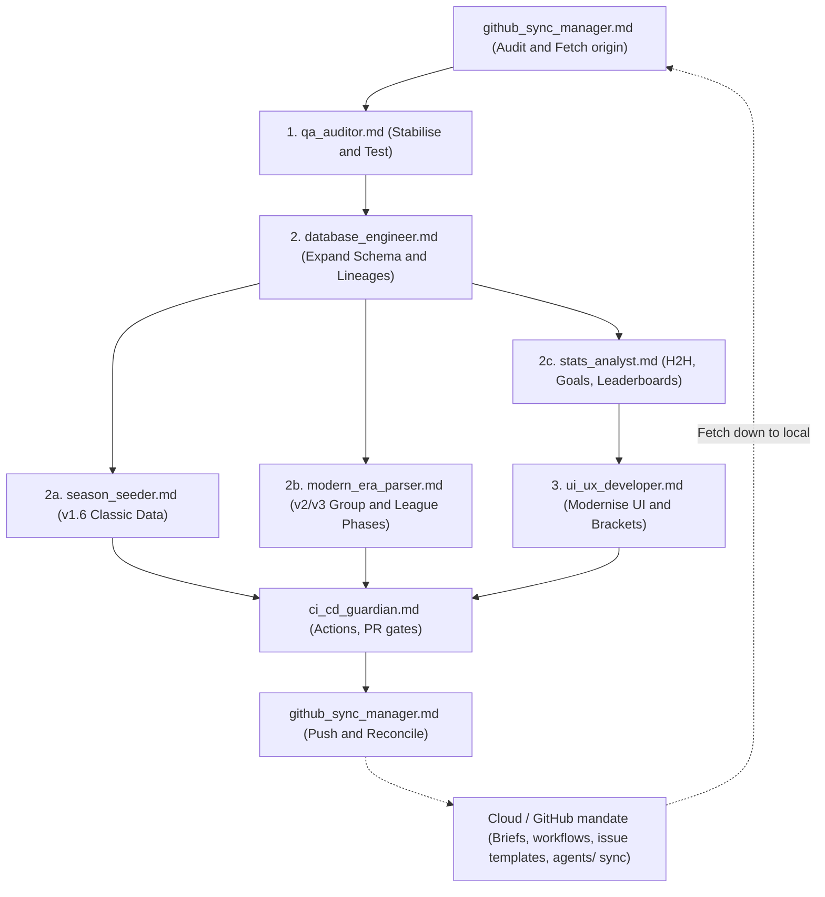

# European Football Database - Agent Roles & Tasks Index

This directory contains autonomous agent task prompts designed for specialised coding assistants (e.g. Grok Bots, Antigravity, Claude Code). Each file provides complete contextual instructions, architectural constraints, step-by-step tasks, and acceptance tests.

---

## Quick Reference Index

| File | Agent Role | Primary Focus | Search Keywords | Phase |
|---|---|---|---|---|
| [`qa_auditor.md`](qa_auditor.md) | **QA & Bug Auditor** | Forensic bug hunt, silent data dropping, N+1 queries, UI layout overlap, test suite | `qa`, `bugs`, `audit`, `edge-cases`, `n+1`, `attendance`, `tests` | **1** (Base Stabilisation) |
| [`database_engineer.md`](database_engineer.md) | **Database & Data Pipeline Engineer** | Schema expansion, period-accurate club names, multi-lineage, ingestion tools, CLI | `database`, `schema`, `sqlite`, `expansion`, `rsssf`, `period-names` | **2** (Data Layer) |
| [`season_seeder.md`](season_seeder.md) | **Classic Era Season Seeder** | Verified European Cup, Cup Winners' Cup and Fairs Cup seasons without group/Swiss work | `rsssf`, `seasons`, `european-cup`, `cup-winners-cup`, `fairs-cup` | **2a** (Classic Data) |
| [`ui_ux_developer.md`](ui_ux_developer.md) | **UI/UX Desktop Application Specialist** | CustomTkinter overhaul, knockout bracket view, rich cards, club profile inspector | `ui`, `ux`, `customtkinter`, `bracket`, `search`, `cards`, `yearbook` | **3** (Application Layer) |
| [`github_sync_manager.md`](github_sync_manager.md) | **GitHub Sync & Cloud Agent Orchestrator** | Git parity, branch reconciliation, untracked staging hygiene, instructing Cloud Agents to create new agents at GitHub | `github`, `git`, `sync`, `remote`, `cloud-agents`, `orchestration` | **Continuous / DevOps** |
| [`modern_era_parser.md`](modern_era_parser.md) | **Modern Era Parser** | 1990s Champions League group stages and 36-team Swiss league phase; protect Classic Era 1955-60 golden data | `group-stage`, `swiss-model`, `league-phase`, `champions-league`, `parser`, `golden-data` | **2b** (Group / Swiss data) |
| [`ci_cd_guardian.md`](ci_cd_guardian.md) | **CI/CD Guardian** | GitHub Actions, PR verification, no force-push to `main`, `build_database.py --force` and pytest as gates | `github-actions`, `ci`, `pytest`, `build_database`, `no-force-push` | **Continuous / CI** |
| [`stats_analyst.md`](stats_analyst.md) | **Stats Analyst** | Head-to-head, goals, and all-time club leaderboards over `european_football.db`, with tests | `stats`, `h2h`, `goals`, `leaderboard`, `cli`, `queries` | **2c** (Statistics) |

---

## Multi-Agent Execution Flow & Hybrid Cloud Coordination

### Cloud / GitHub Mandate
When local bots (such as Hawkeye or local coding assistants) finish local feature implementation, **Cloud Agents operating in the GitHub repository** — or this local provision pushed to `origin` when Cloud Agents are unavailable — must:

1. **Author briefs**: Add and maintain role files in [`agents/`](./), including [`season_seeder.md`](season_seeder.md), [`modern_era_parser.md`](modern_era_parser.md), [`ci_cd_guardian.md`](ci_cd_guardian.md), and [`stats_analyst.md`](stats_analyst.md).
2. **Author workflows**: Keep [`.github/workflows/verify_database.yml`](../.github/workflows/verify_database.yml) so all pushes and pull requests run `python build_database.py --force` and `python -m pytest -q`.
3. **Author issue templates**: Keep [`.github/ISSUE_TEMPLATE/agent_task.yml`](../.github/ISSUE_TEMPLATE/agent_task.yml) for dispatching agent tasks (role, summary, acceptance criteria, branch).
4. **Bi-directional `agents/` sync**: Briefs authored on GitHub are pulled down to `C:\EuroDatabase\agents\`; locally created briefs are pushed up to `origin`. Never force-push to `main`; never skip hooks.
