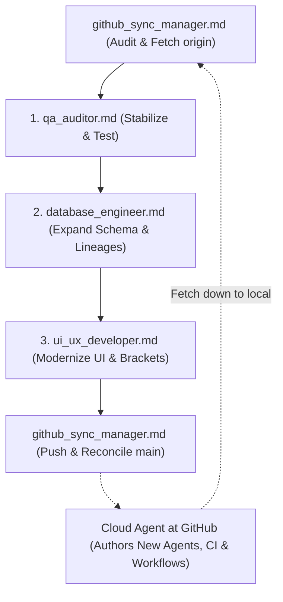

# European Football Database — Agent Roles & Tasks Index

This directory contains autonomous agent task prompts designed for specialized coding assistants (e.g. Grok Bots, Antigravity, Claude Code). Each file provides complete contextual instructions, architectural constraints, step-by-step tasks, and acceptance tests.

---

## Quick Reference Index

| File | Agent Role | Primary Focus | Search Keywords | Phase |
|---|---|---|---|---|
| [`qa_auditor.md`](file:///C:/EuroDatabase/agents/qa_auditor.md) | **QA & Bug Auditor** | Forensic bug hunt, silent data dropping, N+1 queries, UI layout overlap, test suite | `qa`, `bugs`, `audit`, `edge-cases`, `n+1`, `attendance`, `tests` | **1** (Base Stabilization) |
| [`database_engineer.md`](file:///C:/EuroDatabase/agents/database_engineer.md) | **Database & Data Pipeline Engineer** | Schema expansion, period-accurate club names, multi-lineage, ingestion tools, CLI | `database`, `schema`, `sqlite`, `expansion`, `rsssf`, `period-names` | **2** (Data Layer) |
| [`ui_ux_developer.md`](file:///C:/EuroDatabase/agents/ui_ux_developer.md) | **UI/UX Desktop Application Specialist** | CustomTkinter overhaul, knockout bracket view, rich cards, club profile inspector | `ui`, `ux`, `customtkinter`, `bracket`, `search`, `cards`, `yearbook` | **3** (Application Layer) |
| [`github_sync_manager.md`](file:///C:/EuroDatabase/agents/github_sync_manager.md) | **GitHub Sync & Cloud Agent Orchestrator** | Git parity, branch reconciliation, untracked staging hygiene, instructing Cloud Agents to create new agents at GitHub | `github`, `git`, `sync`, `remote`, `cloud-agents`, `orchestration` | **Continuous / DevOps** |

---

## Multi-Agent Execution Flow & Hybrid Cloud Coordination

### Cloud Agent Mandate at GitHub
When local bots (such as Hawkeye or local coding assistants) finish local feature implementation, **Cloud Agents operating in the GitHub repository** are instructed to:
1. **Author New Agent Briefs at GitHub**: Add new role files in `agents/` on GitHub (e.g. `modern_era_parser.md`, `ci_cd_guardian.md`, `stats_analyst.md`).
2. **Provision Automation Workflows**: Set up `.github/workflows/verify_database.yml` so all PRs and pushes run `build_database.py --force` and `pytest`.
3. **Provision Issue Templates**: Add `.github/ISSUE_TEMPLATE/agent_task.yml` for dispatching agent tasks via GitHub Issues.
4. **Bi-Directional Sync**: Any agent files authored on GitHub are pulled down locally, while local agent briefs are pushed up to keep all bots aligned.
