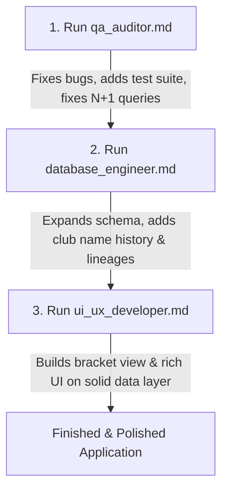

# European Football Database — Agent Roles & Tasks Index

This directory contains autonomous agent task prompts designed for specialized coding assistants (e.g. Grok Bots, Antigravity, Claude Code). Each file provides complete contextual instructions, architectural constraints, step-by-step tasks, and acceptance tests.

---

## Quick Reference Index

| File | Agent Role | Primary Focus | Search Keywords | Phase |
|---|---|---|---|---|
| [`qa_auditor.md`](file:///C:/EuroDatabase/agents/qa_auditor.md) | **QA & Bug Auditor** | Forensic bug hunt, silent data dropping, N+1 queries, UI layout overlap, test suite | `qa`, `bugs`, `audit`, `edge-cases`, `n+1`, `attendance`, `tests` | **1** (First) |
| [`database_engineer.md`](file:///C:/EuroDatabase/agents/database_engineer.md) | **Database & Data Pipeline Engineer** | Schema expansion, period-accurate club names, multi-lineage, ingestion tools, CLI | `database`, `schema`, `sqlite`, `expansion`, `rsssf`, `period-names` | **2** (Second) |
| [`ui_ux_developer.md`](file:///C:/EuroDatabase/agents/ui_ux_developer.md) | **UI/UX Desktop Application Specialist** | CustomTkinter overhaul, knockout bracket view, rich cards, club profile inspector | `ui`, `ux`, `customtkinter`, `bracket`, `search`, `cards`, `yearbook` | **3** (Third) |

---

## Recommended Execution Flow

To achieve the cleanest results without merge conflicts or regressions:

1. **Step 1 (`qa_auditor.md`)**: Fixes existing bugs (e.g. shadowed tie notes, omitted attendances, layout overlap) and establishes regression tests (`tests/`).
2. **Step 2 (`database_engineer.md`)**: Extends the schema and builds data ingestion utilities, verified by the test suite.
3. **Step 3 (`ui_ux_developer.md`)**: Revamps the CustomTkinter UI, introducing the tournament bracket view and rich card displays.
